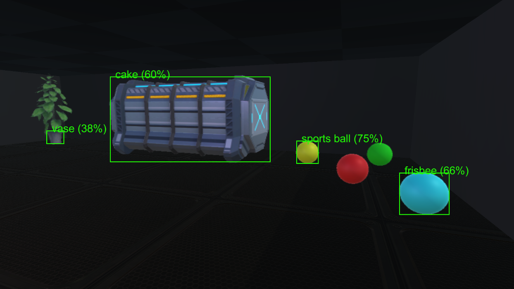
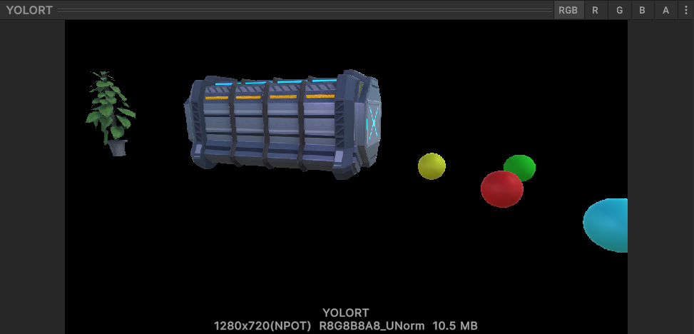
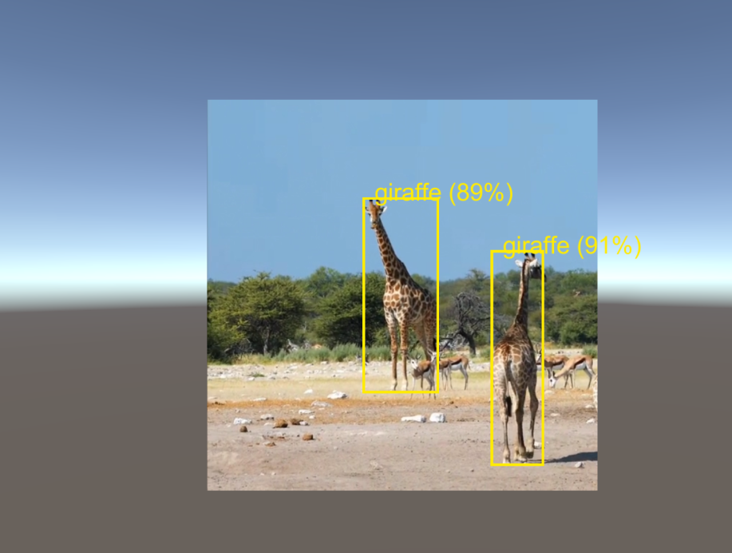

# [sentis-yolotinyv7](https://huggingface.co/unity/sentis-yolotinyv7)

This is a fork of Unity's [`Sentis-samples` repo](https://github.com/Unity-Technologies/sentis-samples). I added a new project "PaintingProject", wherein I integrated the [sentis-yolotinyv7](https://huggingface.co/unity/sentis-yolotinyv7) model ([more models](https://huggingface.co/models?library=unity-sentis)) to enable subject detection from the player's camera. There are 2 scenes:

## `Assets/Scenes/YOLOVision`

    - Replaces the video input with the main camera input, enabling the model to run on the user's main camera feed.
    - One camera is used separately to feed the yolotinyv7 model. The culling flags are set to "Subjects" only. All of the gameobjects that I want the model to see are added to that layer. The main camera renders everything _but_ the subjects.

### Model Input

- It would appear that the model is able to better identify objects when they're isolated on black, as shown below, rather than embedded in their environment:

As mentioned before, this is achieved by setting the culling layer to only those objects assigned to the "subjects" layer.

## `Assets/Scenes/YOLOTest`

    - Uses the provided `YOLORun.cs` script to showcase subject identification in a provided video (mp4).

# Future Plans

- The camera render texture blitting I'm doing is extremely inperformant. I want to take the YOLOVision.output.shape[] data and create UI canvas elements that accomplishes this same bounding box overlay gizmo effect, at a massively smaller cost.
- Create more demo scenes showcasing game use cases.